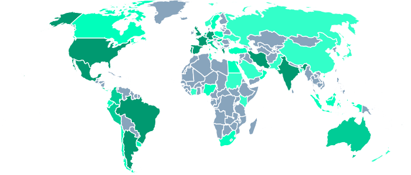

We thank the community for the Plant Transcriptomics workshop that took place last week. The workshop offered a complete crash-course in Galaxy, and built towards miRNA and single-cell RNA topics that were tailored for Arabidopsis genomes. Participants attended from all over the globe for this worldwide event, enabled by the flexible learning resources we provided, with particular interest in the fantastic RNA-based tutorials we have in the GTN. The materials will remain available on Youtube and in the Galaxy Training Network to better empower those who require more flexible time constraints.

Despite the limitations of the online settings, the registration was high (more than 450 registered students and close to 200 participants in chat) and the videos on YouTube were also popular with ample views.

The response so far has been overwhelmingly positive, with feedback snippets such as:

* “Overall comment: great job! Given the difficult times we are living in, this was great!”
* (The best thing about this workshop is) “that you could do everything at your own pace, some days I had lab work but I could still start in the afternoon or evening. This was very nice.”
* “The tutorial text and the videos are great. Each one complements the other. The galaxy platform was friendly too. I can remember the commands / tools lesson by lesson. Also, the availability of the materials after the workshop is great!!”

The workshop was primarily hosted from European timezones, but active training participation from volunteers all over the world enabled us to host the event as a worldwide workshop:

