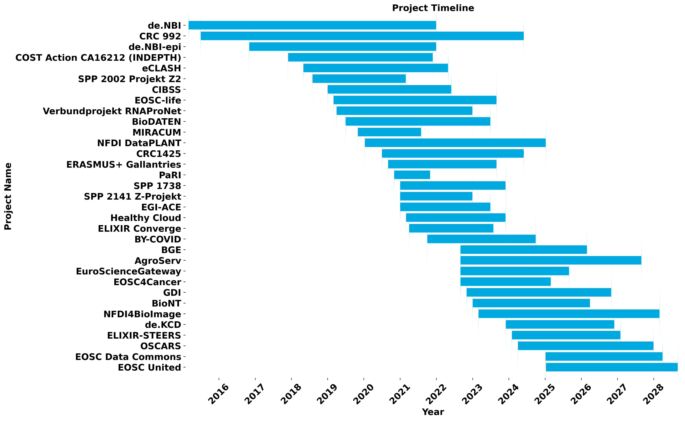

# OUR PROJECTS

---

# Overview
---

The [Freiburg Galaxy team](https://usegalaxy-eu.github.io/people) is involved in numerous national and international projects and grants spanning research infrastructure, data management, and training initiatives. This section provides an overview of their active and completed collaborations supporting the Galaxy community and beyond.

| Project name | Start | End |
| --- | --- | --- |
| [de.NBI](https://www.denbi.de/) | 01/03/2015 | 31/12/2021 |
| [EOSC-life](https://cordis.europa.eu/project/id/824087) | 01/03/2019 | 31/08/2023 |
| [ERASMUS+ Gallantries](https://erasmus-plus.ec.europa.eu/projects/search/details/2020-1-NL01-KA203-064717) | 01/09/2020 | 31/08/2023 |
| [EGI-ACE](https://cordis.europa.eu/project/id/101017567) | 01/01/2021 | 30/06/2023 |
| [PaRI](https://neic.no/pari/) | 01/11/2020 | 31/10/2021 |
| [EOSC4Cancer](https://cordis.europa.eu/project/id/101058427) | 01/09/2022 | 28/02/2025 |
| [EuroScienceGateway](https://cordis.europa.eu/project/id/101057388) | 01/09/2022 | 31/08/2025 |
| [ELIXIR Converge](https://cordis.europa.eu/project/id/871075) | 01/04/2021 | 31/07/2023 |
| [BY-COVID](https://cordis.europa.eu/project/id/101046203) | 01/10/2021 | 30/09/2024 |
| [GDI](https://gdi.onemilliongenomes.eu/) | 01/11/2022 | 31/10/2026 |
| [AgroServ](https://cordis.europa.eu/project/id/101058020) | 01/09/2022 | 31/08/2027 |
| [BGE](https://cordis.europa.eu/project/id/101059492) | 01/09/2022 | 28/02/2026 |
| [BioNT](https://ec.europa.eu/info/funding-tenders/opportunities/portal/screen/opportunities/projects-details/43152860/101100604) | 01/01/2023 | 31/03/2026 |
| [Healthy Cloud](https://cordis.europa.eu/project/id/965345) | 01/03/2021 | 30/11/2023 |
| [OSCARS](https://eosc.eu/horizon-europe-projects/oscars/) | 01/04/2024 | 31/12/2027 |
| [ELIXIR-STEERS](https://elixir-europe.org/about-us/how-funded/eu-projects/steers) | 01/02/2024 | 31/01/2027 |
| [NFDI4BioImage](https://nfdi4bioimage.de/home/) | 01/03/2023 | 29/02/2028 |
| [Verbundprojekt Deutsches Kompetenzzentrum Cloud-Technologien für Datenmanagement und -verarbeitung de.KCD](https://datenkompetenz.cloud/) | 01/12/2023 | 30/11/2026 |
| [CRC1425](https://www.sfb1425.uni-freiburg.de/) | 01/07/2020 | 01/06/2024 |
| [CRC 992](https://www.sfb992.uni-freiburg.de/) | 01/07/2015 | 01/06/2024 |
| [NFDI DataPLANT](https://www.nfdi4plants.org/) | 10/01/2020 | 09/01/2025 |
| [MIRACUM](https://www.miracum.org/) | 01/11/2019 | 01/08/2021 |
| [BioDATEN](https://portal.biodaten.info/) | 01/07/2019 | 30/06/2023 |
| de.NBI-epi | 01/11/2016 | 31/12/2021 |
| [SPP 1738](https://gepris.dfg.de/gepris/projekt/237182749?context=projekt&task=showDetail&id=237182749&) | 01/01/2021 | 01/12/2023 |
| [eCLASH](https://freidok.uni-freiburg.de/proj/7068) | 01/05/2018 | 30/04/2022 |
| [SPP 2141 Z-Projekt](https://freidok.uni-freiburg.de/proj/8048) | 01/01/2021 | 31/12/2022 |
| [SPP 2002 Projekt Z2](https://freidok.uni-freiburg.de/proj/8046) | 01/08/2018 | 28/02/2021 |
| [CIBSS](https://www.cibss.uni-freiburg.de/) | 01/01/2019 | 01/06/2022 |
| [Verbundprojekt RNAProNet](https://www.gesundheitsforschung-bmftr.de/de/rnapronet-integration-der-netzwerke-aus-rna-und-proteinbasierender-regulation-9165.php) | 01/04/2019 | 31/12/2022 |
| [COST Action CA16212 (INDEPTH)](https://www.cost.eu/actions/CA16212/) | 28/11/2017 | 27/11/2021 |
| [EOSC United](https://cordis.europa.eu/project/id/101215594) | 09/01/2025 | 31/08/2028 |
| [EOSC Data Commons](https://cordis.europa.eu/project/id/101188179) | 04/01/2025 | 31/03/2028 |

---

# Galaxy and its community
---

The [Freiburg Galaxy team](https://usegalaxy-eu.github.io/people) is highly involved in many projects related to the global Galaxy community:

- Galaxy core development and maintenance.
- Lead of the European Galaxy Server with 2,700 bioinformatics tools and access to large compute infrastructures.
- Tool integration into Galaxy and their maintenance (update to newstes version and version tracking) through:
    - [Intergalactic Utilities Commission (IUC)](https://galaxyproject.org/iuc).
    - [Björn's repository](https://github.com/bgruening/galaxytools).
- [Galaxy Training Material](https://galaxyproject.github.io/training-material), a collection of Galaxy-related tutorials and its infrastructure, developed and maintained by the community.
- [Galaxy Docker](https://github.com/bgruening/docker-galaxy-stable), to provide an easy distributable full-fledged Galaxy installation.
- Development and maintenance of different [Galaxy flavours](/about).
- Jupyter integration into Galaxy.
- [GalaxyP](http://galaxyp.org), a Galaxy community dedicated to developing [tools](https://github.com/galaxyproteomics/tools-galaxyp), workflows and [training material](https://galaxyproject.github.io/training-material/topics/proteomics/) for proteomic research.
- [Galaxy Genome Annotation (GGA)](https://galaxy-genome-annotation.github.io/), a group of projects focused on supporting genome annotation inside Galaxy.

---

# EuroScienceGateway
---
With the [EuroScienceGateway](https://eurosciencegateway.eu) (ESG) project, the European Galaxy community received a direct funding for the first time from the European Commission through a successful Horizon-Europe grant. Since September 2022, this project allows us together with 15 European partners to leverage a federated open access computational infrastructure through Galaxy as a gateway for data resources, tools and applications by the FAIR principle. It provides more resources for users (via Galaxy and Coud APIs) to all users in Europe - national Galaxy servers included.

---

# Bioconda and BioContainers
---

Spending valuable time in compilation/installation should not be a problem nowadays. Therefore, the Freiburg Galaxy team is leading the [Bioconda](https://bioconda.github.io) and [BioContainers](https://biocontainers.pro) projects, which together form the best stack for reproducible science ever.

Bioconda is a channel for the conda package manager specializing in bioinformatics with around 9,000 bioinformatics packages ready to use with `conda install`.

BioContainers is an open source and community-driven framework which provides system-agnostic executable environments for bioinformatics software, with around 70,000 containers ready to use.

---

# Infrastructure Projects
---

### de.NBI

The Freiburg Galaxy team is part of [de.NBI](https://www.denbi.de), the German Network for Bioinformatics Infrastructure, through the [RNA Bioinformatics Center](https://www.denbi.de/network/rna-bioinformatics-center-rbc). de.NBI is a national infrastructure project providing training, cooperations & cloud computing through the de.NBI cloud with substantial compute and storage resources for bioinformatic use-cases.

### ELIXIR

ELIXIR unites Europe’s leading life science organizations in managing and safeguarding the increasing volume of data being generated by publicly funded research. Via de.NBI, the Freiburg Galaxy team is also involved in [ELIXIR](https://www.elixir-europe.org), as technical coordinator for the [German node](https://www.elixir-europe.org/about-us/who-we-are/nodes/germany).

The Freiburg Galaxy team is also co-leading the [ELIXIR Galaxy Community](https://www.elixir-europe.org/communities/galaxy), particularly with the maintenance of European Galaxy instance ([usegalaxy.eu](https://usegalaxy.eu)). Monthly meetings, webinars and various activities are organised around the ELIXIR Galaxy Community.

The team has participated in several [ELIXIR Implementation Studies](https://elixir-europe.org/about-us/commissioned-services?combine=&field_categories_tid=1221&field_funding_sources_tid=All&field_elixir_node_target_id=All&status=All) since 2018:
- ELIXIR Implementation Study - Galaxy Community, in 2018, with a focus on setting up the newly established ELIXIR Galaxy Community
- Expanding the Galaxy: meeting (the needs of) ELIXIR Communities, 2019
- Strengthen Data Management in Galaxy, 2021
- Reference hCNV datasets, use-case workflows and benchmarking, 2021
- Beacon and beyond — Implementation-driven standards and protocols for CNV discovery and data exchange, 2021
- Deploying Reproducible Containers and Workflows Across Cloud Environments, 2021

### EOSC-Life

The European Open Science Cloud (EOSC), and [EOSC-Life](https://www.eosc-life.eu/) in particular, brings together the 13 Life Science ‘ESFRI’ research infrastructures to create an open, digital and collaborative space for biological and medical research. The project will publish ‘FAIR’ data and a catalog of services provided by participating RIs for the management, storage and reuse of data in the European Open Science Cloud.

Galaxy is a key player in [WP2 on Tools & Workflows](https://www.eosc-life.eu/tools-workflows) and WP7, around [Cloud Deployment](https://www.eosc-life.eu/about/work-packages).

### EOSC4Cancer

[EOSC4Cancer](https://eosc4cancer.eu) will make diverse types of cancer data accessible: genomics, imaging, medical, clinical, environmental and socio-economic. It will use and enhance federated and interoperable systems for securely identifying, sharing, processing and reusing FAIR data across borders and offer them via community-driven analysis environments.

Galaxy is a partner in [WP3 Tool Integration & Visualization](https://eosc4cancer.eu/wp-3) and [WP1 FAIR Data](https://eosc4cancer.eu/wp-1).

### BGE/VGP ERGA

The [Vertebrate Genome Project](https://galaxyproject.org/projects/vgp) is an international collaborative effort by the G10K consortium to generate near error-free genome assemblies for more than 70,000 vertebrate species. Using Galaxy infrasctructure and public instances, this collaboration has generated new, more open methods of genome assembly and access to data.

### AgroServ

[AgroServ](https://emphasis.plant-phenotyping.eu/european-infrastructures/cluster-projects/agroserv) supports research and innovation by providing customized and integrated RI services in view of achieving a sustainable and resilient agriculture and supporting agroecological transitions. This aim will take place in line with the One-Health approach, with particular regard to threats and risks on agroecosystems and to enhance new agroecological practices and their socio-economic benefits. Through the AgroServ Data Portal, Galaxy tools  and workflows will be provided. The project started in 2022.

### EGI-ACE

[European Grid Infrastructure - Advanced Computing for EOSC (EGI-ACE)](https://www.egi.eu/projects/egi-ace) is a 30-month project coordinated by the EGI Foundation with a mission to empower researchers from all disciplines to collaborate in data- and compute-intensive research through free-at-point-of-use services.

### Healthy-Cloud

The objective of the Horizon 2020 EU project [HealthyCloud](https://healthycloud.eu) is to generate a number of guidelines, recommendations and specifications that will enable distributed health research across Europe in the form of a Ready-to-implement Roadmap.

### PaRI

The [Pandemic Research Infrastructure (PaRI)](https://neic.no/pari) project brings together the needs, interests and resources to create e-infrastructure to support research excellence in the Nordic region.

---

# Data Management Projects
---

### BioDATEN

The aim of the project [BioDATEN (Bioinformatics DATa ENvironment)](https://portal.biodaten.info) is to provide the foundation of a Science Data Centre in close cooperation with the life science communities such as research groups and infrastructure providers such as libraries and computing centres.

### DataPLANT

The NFDI [DataPLANT](https://nfdi4plants.de/) consortium provides services to complement existing infrastructures and focuses on supporting and easing the processes of complete and meaningful research metadata management in plant sciences.

### NFDI4Bioimage

The [NFDI4Bioimage](https://nfdi4bioimage.de/en/start) is a consortium of the National Research Data Infrastructure (Nationale Forschungsdateninfrastruktur, NFDI) in Germany. The focus is on all steps of the research data life cycle for microscopy and bioimage analysis. The NFDI4Bioimage consortium started in November 2022. The Galaxy Team is involved in TA2 and for it, we provide remote access to powerful compute resources via virtual workstations for analysis, visualization, and training.

### Genome Data Infrastructure (GDI)

The Genomic Data Infrastructure (GDI) project brings together national agencies, research organisations, and technology providers in
22 countries to provide a cross-border federated network of national genome collections, associated with other relevant data, for
advancing data-driven biomedical research and personalised medicine solutions to benefit citizens of Europe. The Galaxy Team WP7 (Major contribution on the infection diseases use-case building on the current projects for analysing viral COVID-19 sequencing data) and WP8 (Major technological contributions to the use of innovative approaches for federated discovery, access and learning connected with the European Galaxy platform).

### ELIXIR-CONVERGE

[ELIXIR-CONVERGE](https://elixir-europe.org/about-us/how-funded/eu-projects/converge) will deliver the provisioning, across Europe, of distributed local support for data management. This will be based on a toolkit for researchers that enables lifecycle management for their research data, in compliance with international standards.

---

# Research Projects
---

### MIRACUM

The goal of the [MIRACUM (Medical Informatics for Research and Care in University Medicine)](https://www.miracum.org) project is to foster IT innovations for healthcare research and medical care. The project aims for accessibility and usability of clinical data, imaging data and data from molecular and genomics analyses at local and across different locations through a modular, scalable and federated data integration center. Taking advantage of digitalization in medicine, linking data and generating medical knowledge is required for a better, data-based healthcare delivery system. MIRACUM unites 10 university hospitals, 2 universities, and an industrial partner from 7 German federal states.

As part of the MTB (Molecular Tumor Board) use case, the Freiburg Galaxy team is developing and maintaining together with [Melanie Börries](https://www.mol-med.uni-freiburg.de/mom/boerries) the EXOM-seq pipeline in Galaxy.

### BY-COVID

The [BeYond-COVID](https://by-covid.org) project aims to make COVID-19 data accessible to scientists in laboratories but also to anyone who can use it, such as medical staff in hospitals or government officials. Going beyond SARS-CoV-2 data, the project will provide a framework for making data from other infectious diseases open and accessible to everyone.

### CRC 1425

The [Collaborative Research Centre 1425 - "Heterocellular Nature of Cardiac Lesions: Identities, Interactions, Implications"]((https://www.sfb1425.uni-freiburg.de/)) brings together scientists working in cardiac research.

### CRC 992

As part of the [Collaborative Research Centre 992 - "Medical Epigenetics"](https://www.sfb992.uni-freiburg.de/), the Freiburg Galaxy team is helping researchers to analyse their epigenetic data. In this framework, we are developing and maintaining deepTools and [HiCExplorer](https://hicexplorer.readthedocs.io) together with the [group of Thomas Make](https://www.ie-freiburg.mpg.de/de/bioinformaticsfac) from MPI-IE.

### COST Action CA16212

Plants are vital to human life and health and are essential to mitigate the effects of climate change. In this COST Action for [Impact of Nuclear Domains On Gene Expression and Plant Traits](http://www.cost.eu/COST_Actions/ca/CA16212), the Freiburg Galaxy team is helping to connect the European plant community and foster FAIR data principles.

---

# Software Projects
---

### HiCExplorer

[HiCExplorer](https://hicexplorer.readthedocs.io/en/documentation/) is a set of programs to process, normalize, analyze and visualize Hi-C data. It addresses the common tasks of Hi-C analysis from processing to visualization. The Freiburg Galaxy team is involved in the maintenance and new development of HiCExplorer. You can access HiCExplorer via [https://hicexplorer.usegalaxy.eu](https://hicexplorer.usegalaxy.eu).

### deepTools

[deepTools](https://deeptools.readthedocs.io) is a suite of python tools particularly developed for the efficient analysis of high-throughput sequencing data, such as ChIP-seq, RNA-seq or MNase-seq. deepTools is the Swiss Army Knife of NGS processing and is cited
more than 3,000 times. It is of course part of the European Galaxy server and was used more than 230,000 times.

---

# Capacity Building and Training Projects
---

### Gallantries

The [Gallantries](https://gallantries.github.io/) project aims to increase bioinformatics and core data analysis skills in the field of life sciences across Europe.

### Open Life Science 

[Open Life Science (OLS)](https://openlifesci.org) is a 16-week long mentoring & training program for Open Science ambassadors. Currently the call for the
4th round - OLS-4 - is running.

### StreetScience Project

In the [Street Science community](https://streetscience.community/), we want to make science tangible & accessible by bringing it to the
“street” via open science workshops. These workshops are an excuse to meet, discuss, educate and develop ideas in a neutral, open,
noncompetitive and not-for-profit environment.

### BioNT

BioNT, the [BIO Network for Training](http://biont-training.eu/), is a consortium project aiming at delivering bioinformatics training across sectors, including training for Industry employees and job seekers.
