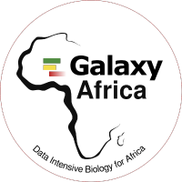

{:.sc-intro-left}
# This is the African galaxy server, Welcome Home!
{:.no_toc}

Hi there! Welcome to the African Galaxy workbench; a comprehensive set of tools and workflows dedicated to accelerate your bioinformatics analyses. This workbench is built on the Galaxy framework, which guarantees simple access, easy extension, flexible adaptation to personal and security needs, and sophisticated analyses independent of command-line knowledge. Simply put, this is your bioinformatics “plug and play”.
The current implementation comprises more than 2000 bioinformatics tools dedicated to different bioinformatics research applications such as Genomics, Epigenomics, Phylogenetics, Transcriptomics, Microbiology and many more.

 

1. TOC
{:toc}

# Getting Started
Are you new to Galaxy, or returning after a long time, and looking for help to get started? Take [a guided tour]({{ page.website }}/tours/core.galaxy_ui){:target="_blank"} through Galaxy's user interface.

# Training
From theoretical understanding to practical implementation on this workbench, we are passionate about training. So we work in close collaboration with the [Galaxy Training Network (GTN)](https://galaxyproject.org/teach/gtn/){:target="_blank"} to develop training materials of data analyses based on Galaxy . These materials hosted on the GTN GitHub repository are available online at [https://training.galaxyproject.org](https://training.galaxyproject.org){:target="_blank"}.

# Tool Categories
* NGS Data QC and Preprocessing
  * Quality Control
  * Data Prepreocessing
* Genomics
  * Genome assembly
  * Genome Annotation
  * Variant Analysis
* Transcriptomics
  * Bulk RNA Sequencing
  * Single RNA Sequencing
Epigenetics
  * Chip-Seq
  * ATAC-Seq
  * Bisulfite Sequencing
Metagenomics
  * 16S metagenomics
  * Metatranscriptomics
Machine learning
  * Classification & Regression
  * Clustering
  * Regression
  * Deep learning
  
# Appreciation
We sincerely appreciate the efforts of all individuals and their organizations for supporting the African Galaxy Instance. Join the community [here](https://gitter.im/GalaxyAfrica/community)


