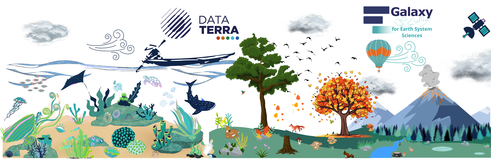
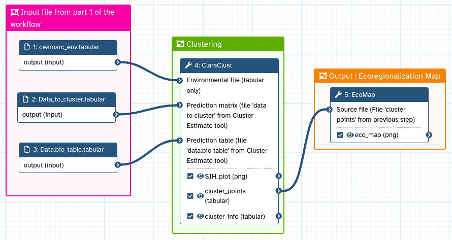
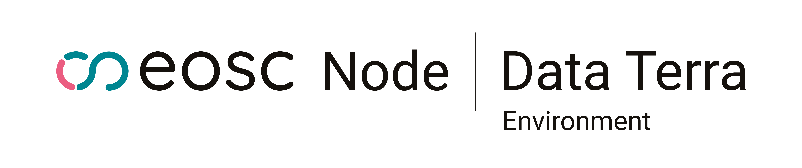
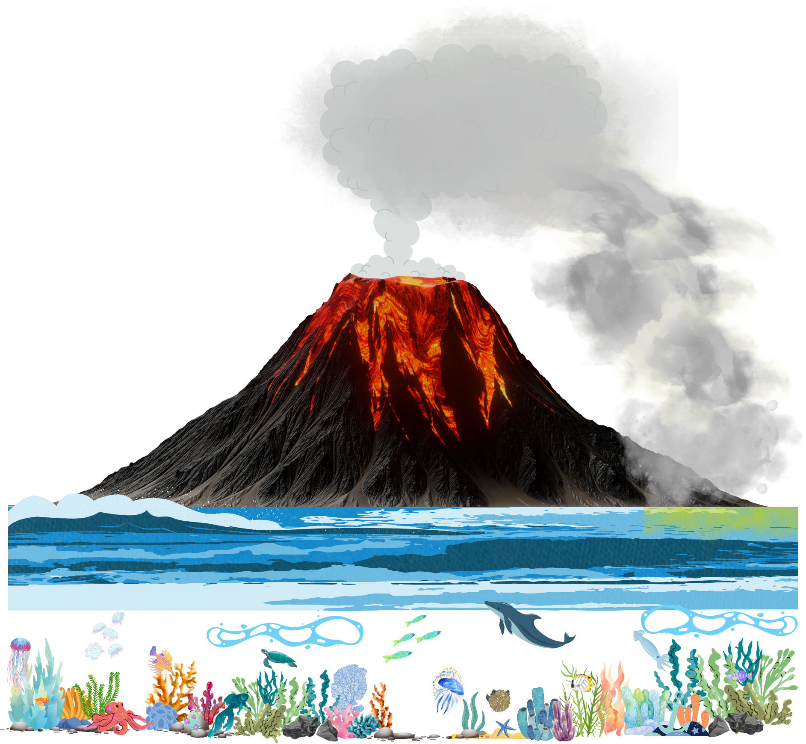

# Welcome to **Galaxy for Earth System Sciences** -- a web platform to get, process, analyze and visualize environmental data

  

  <!-- CARD 1 -->
  

    

      

        <h2 class="card-title text-dark" style="margin-top: 0;">Guide tour</h2>
        
Are you new to Galaxy, or returning after a long time, and looking for help to get started?

        
        

          <a href="https://ecology.usegalaxy.eu/tours/core.galaxy_ui" target="_blank">
            <button type="button" class="btn btn-primary btn-lg" style="white-space:normal; max-width:100%; display:inline-block;">Take a guide tour through Galaxy’s user interface.</button>
          </a>
        

      

    

  

  <!-- CARD 2 -->
  

    

      

        <h2 class="card-title text-dark" style="margin-top: 0;">Tutorials</h2>
        
Want to learn about ecology analyses?

        
        

          <a href="https://training.galaxyproject.org/training-material/search2?query=earth-system" class="show-iframe" data-target="displayhere">
            <button type="button" class="btn btn-primary btn-lg" style="white-space:normal; max-width:100%; display:inline-block;">Check our tutorials</button>
          </a>
        

      

    

  

  <!-- CARD 3 -->
  

    

      

        <h2 class="card-title text-dark" style="margin-top: 0;">Workflows</h2>
        
Write earth-system in the search !

        
        

          <a href="https://earth-system.usegalaxy.eu/workflows/list_published" target="_blank">
            <button type="button" class="btn btn-primary btn-lg" style="white-space:normal; max-width:100%; display:inline-block;">Access public workflows</button>
          </a>
        

      

    

  

  
<iframe id="displayhere" frameborder="0" style="display:none;" width="100%" height="700"></iframe>

# Projects

  <!-- CARD 1 -->
  

    

        

            <h2 class="card-title text-dark" style="margin-top: 0;">GAIA DATA</h2>
            

                Equipex+ PIA3
            

            <a href="https://www.gaia-data.org/" target="_blank">
                

            </a>
            

                
TUTORIALS

                

                    <a href="https://training.galaxyproject.org/training-material/topics/climate/tutorials/earth_system/tutorial.html" class="show-iframe" data-target="displayhere2">
                        <button type="button" class="btn btn-primary">Earth data</button>
                    </a>                    
                    <a href="https://training.galaxyproject.org/training-material/topics/ecology/tutorials/remote-sensing/tutorial.html" class="show-iframe" data-target="displayhere2">
                        <button type="button" class="btn btn-primary">Sentinel 2 for biodiversity</button>
                    </a>
                    <a href="https://training.galaxyproject.org/training-material/topics/ecology/tutorials/Ecoregionalization_tutorial/tutorial.html" class="show-iframe" data-target="displayhere2">
                        <button type="button" class="btn btn-primary">Ecoregionalization</button>
                    </a>
                

            

            

                
TOOLS

                

                    <a href="https://ecology.usegalaxy.eu/root?tool_id=interactive_tool_jupytergis_notebook" target="_blank">
                        <button type="button" class="btn btn-primary">JupyterGIS interactive tool</button>
                    </a>
                    <a href="https://ecology.usegalaxy.eu/root?tool_id=interactive_tool_pangeo_notebook" target="_blank">
                        <button type="button" class="btn btn-primary">Pangeo interactive tool</button>
                    </a>
                    <a href="https://ecology.usegalaxy.eu/root?tool_id=interactive_tool_qgis" target="_blank">
                        <button type="button" class="btn btn-primary">QGIS interactive tool</button>
                    </a>
                     <a href="https://ecology.usegalaxy.eu/root?tool_id=interactive_tool_stac" target="_blank">
                        <button type="button" class="btn btn-primary">STAC catalog</button>
                    </a>
                

            

        

    

  

  <!-- CARD 2 -->
  

    

      

        <h2 class="card-title text-dark" style="margin-top: 0;">Data Terra - EOSC Node</h2>
        

          EOSC
          European commission
        

        
        

            
TUTORIALS

            

                <a href="https://training.galaxyproject.org/training-material/topics/imaging/tutorials/voronoi-segmentation/tutorial.html" class="show-iframe" data-target="displayhere2">
                    <button type="button" class="btn btn-primary">Voronoi segmentation</button>
                </a>
            

        

        

            
WORKFLOWS

            

                <a href="https://earth-system.usegalaxy.eu/published/workflow?id=23030421cd9fcfb2" target="_blank">
                    <button type="button" class="btn btn-primary">Voronoi segmentation</button>
                </a>
                <a href="https://earth-system.usegalaxy.eu/published/workflow?id=7f8ff64c5ea03a9b" target="_blank">
                    <button type="button" class="btn btn-primary">Voronoi segmentation with seed generation</button>
                </a>
            

        

    

  

  <!-- CARD 3 -->
  

    

      

        <h2 class="card-title text-dark" style="margin-top: 0;">Hunga Tonga usecase</h2>
        

          EOSC
        

        
        

            
Hackathon, where it all began

            

                <a href="https://galaxyproject.org/news/2025-04-02-fair-ease-brest-hackathon-2025-news-post/"class="show-iframe" data-target="displayhere2">
                    <button type="button" class="btn btn-primary">Hunga Tonga Hackathon</button>
                </a>
            

        

        

            
Want to know more ?

            

                <a href="https://lab.fairease.eu/book-hunga-tonga/" target="_blank">
                    <button type="button" class="btn btn-primary">Hunga Tonga Book</button>
                </a>
            

        

        

            
TOOLs

            

                <a href="https://earth-system.usegalaxy.eu/root?tool_id=interactive_tool_terriamap" target="_blank">
                    <button type="button" class="btn btn-primary">TerriaMap</button>
                </a>
                
Several tools corresponding to these usecase can be found in Galaxy's left sidebar in the interactive tools section under the Ocean and Land & soil and the Earth System tools section.

            

        

    

  

  <!-- CARD 4 -->
  

    

        

            <h2 class="card-title text-dark" style="margin-top: 0;">FAIR-EASE</h2>
            

                EOSC
                European commission
            

            
            
Use cases

            

                <a href="https://lab.fairease.eu/book-water-coastal-dynamics/" target="_blank">
                    <button type="button" class="btn btn-primary">Coastal Water Dynamics</button>
                </a>
                <a href="https://lab.fairease.eu/book-volcano-space-observatory/" target="_blank">
                    <button type="button" class="btn btn-primary">Volcano Space Observatory</button>
                </a>
                <a href="https://fairease.eu/kers/earth-critical-zone-pilot" class="show-iframe" data-target="displayhere2">
                    <button type="button" class="btn btn-primary">Earth Critical Zone</button>
                </a>
                <a href="https://lab.fairease.eu/book-ocean-bgc/" target="_blank">
                    <button type="button" class="btn btn-primary">Ocean Bio-geochemical observation</button>
                </a>
                <a href="https://lab.fairease.eu/book-marine-omics-observation/" target="_blank">
                    <button type="button" class="btn btn-primary">Marine Omics observation</button>
                </a>
            

            
Tutorials

            

                <a href="https://training.galaxyproject.org/training-material/topics/climate/tutorials/ocean-data-view/tutorial.html" class="show-iframe" data-target="displayhere2">
                     <button type="button" class="btn btn-primary">Ocean's variables study</button>
                </a>
            

            

                <a href="https://training.galaxyproject.org/training-material/topics/climate/tutorials/sentinel5_data/tutorial.html" class="show-iframe" data-target="displayhere2">
                     <button type="button" class="btn btn-primary">Sentinel 5P data visualisation</button>
                </a>
            

            

                <a href="https://training.galaxyproject.org/training-material/topics/ecology/tutorials/QGIS_Web_Feature_Services/tutorial.html" class="show-iframe" data-target="displayhere2">
                     <button type="button" class="btn btn-primary">QGIS Web Feature Services</button>
                </a>
            

            

                <a href="https://training.galaxyproject.org/training-material/topics/climate/tutorials/ocean_qcv_analysis/tutorial.html" class="show-iframe" data-target="displayhere2">
                     <button type="button" class="btn btn-primary">Nitrate DMQC for autonomous platforms such as Argo floats</button>
                </a>
            

            

                <a href="https://training.galaxyproject.org/training-material/topics/ecology/tutorials/marine_omics_bgc/tutorial.html" class="show-iframe" data-target="displayhere2">
                     <button type="button" class="btn btn-primary">Marine Omics identifying biosynthetic gene clusters</button>
                </a>
            

            
Learning Pathway

            

                <a href="https://training.galaxyproject.org/training-material/learning-pathways/dev_tools_training.html" class="show-iframe" data-target="displayhere2">
                    <button type="button" class="btn btn-primary">Tool development for a nice & shiny subdomain</button>
                </a>
            

        

            
Workflows

            

                <a href="https://earth-system.usegalaxy.eu/published/workflow?id=44827462c065bae3" target="_blank">
                    <button type="button" class="btn btn-primary">Argo-Glider Nitrate QCV</button>
                </a>
                <a href="https://earth-system.usegalaxy.eu/published/workflow?id=26fe6b0fb6ca2892" class="show-iframe" data-target="displayhere2">
                    <button type="button" class="btn btn-primary">Ocean's variables</button>
                </a>
            

        

    

  

  
<iframe id="displayhere2" frameborder="0" style="display:none;" width="100%" height="700"></iframe>

    <a href="https://galaxyproject.org/community/sig/earth/" class="show-iframe" data-target="displayhere3">Earth SIG</a>

  
<iframe id="displayhere3" frameborder="0" style="display:none;" width="100%" height="700"></iframe>
  

  

