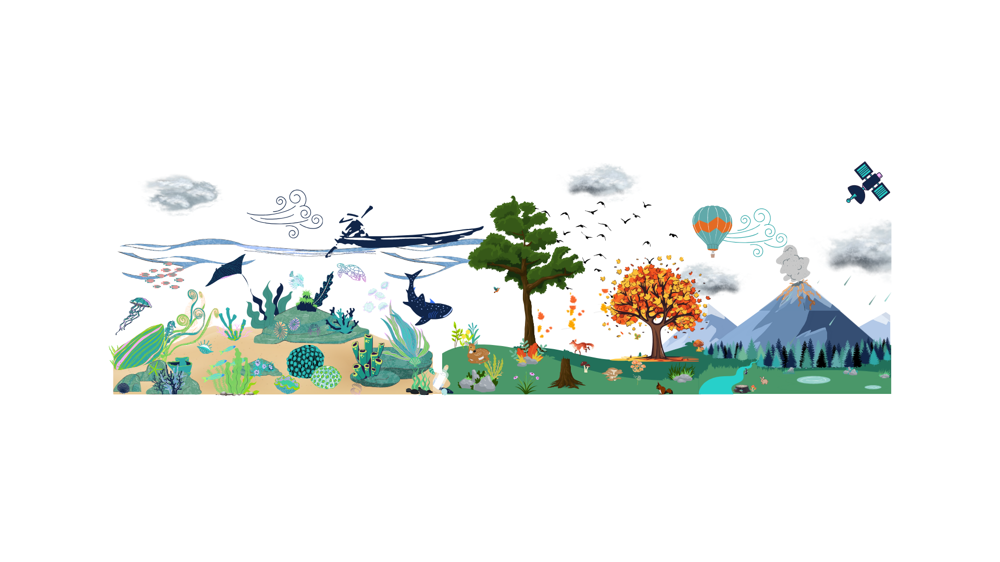

{:.sc-intro-left}

# Welcome to Galaxy for Earth System and environment

{:.no_toc}
 
Galaxy for Earth System and environment was implemented within the project [**Fair-Ease**](https://fairease.eu/){:target="_blank"}. It's a virtual platform to process, analyse and visualize Earth System, Environment and Biodiversity data. It is based on the [Galaxy framework](https://galaxyproject.org){:target="_blank"}, which guarantees simple access, easy extension, flexible adaption to personal and security needs, and sophisticated analyses independent of command-line knowledge.

 
# Content
{:.no_toc}

1. TOC
{:toc}

# Get started

Are you new to Galaxy, or returning after a long time, and looking for help to get started? Take a [__guided tour__]({{ page.website }}/tours/core.galaxy_ui){:target="_blank"} through Galaxy's user interface.

# Tools

Multiple tools on Earth System, Environment and Biodiversity data analysis will be available in this custom Galaxy instance:

- **General tools**
    - [QGIS](https://earth-system.usegalaxy.eu/root?tool_id=interactive_tool_qgis)
    - [HDFviewer](https://earth-system.usegalaxy.eu/root?tool_id=interactive_tool_hdfviewer)
    - [Holoviz](https://earth-system.usegalaxy.eu/root?tool_id=interactive_tool_holoviz)
- **Coastal Water Dynamics tools**
    - Ocean Data viewer [ODV](https://earth-system.usegalaxy.eu/root?tool_id=interactive_tool_odv)
    - [DIVAnd](https://earth-system.usegalaxy.eu/root?tool_id=interactive_tool_divand)
    - [Source](https://earth-system.usegalaxy.eu/root?tool_id=interactive_tool_source)
- **Bio-GeoChemical tools**
    - [Scoop Argo](https://earth-system.usegalaxy.eu/root?tool_id=interactive_tool_scoop3_argo)
- **Marine omics tools**
- **Earth critical zone tools** on land degradation
- **Volcano tools**

# Training

We are working in close collaboration with the [__Galaxy Training Network (GTN)__](https://training.galaxyproject.org){:target="_blank"} to develop training materials of data analyses based on Galaxy. If you want to know more about the GTN or how to become part of the Galaxy community, check the videos below!

<iframe width="560" height="315"
src="https://www.youtube.com/embed/lDqWxzWNk1k"
title="YouTube video player"
frameborder="0"
allow="accelerometer; autoplay; clipboard-write; encrypted-media; gyroscope; picture-in-picture"
allowfullscreen>
</iframe>

<iframe width="560" height="315"
src="https://www.youtube.com/embed/-1MPdxmRs8U"
title="YouTube video player"
frameborder="0"
allow="accelerometer; autoplay; clipboard-write; encrypted-media; gyroscope; picture-in-picture"
allowfullscreen></iframe>

  

**Training material**

All relevant materials for Earth System, Environment and Biodiversity data analysis will be available within the GTN.

- [Welcome and introduction to Galaxy](https://training.galaxyproject.org/topics/introduction/tutorials/galaxy-intro-short/slides.html)
- [How to use QGIS](https://training.galaxyproject.org/training-material/topics/ecology/tutorials/QGIS_Web_Feature_Services/tutorial.html)
- [How to use ODv with netcdf files](https://training.galaxyproject.org/training-material/topics/climate/tutorials/ocean-data-view/tutorial.html)
- [How to use ODV collections](https://training.galaxyproject.org/training-material/topics/climate/tutorials/ocean-variables/tutorial.html)

# Workflows

To orchestrate tools and help users with their analyses, several [workflows](https://galaxyproject.org/learn/advanced-workflow/){:target="_blank"} will be available. They formally orchestrate tools in a defined order and with defined parameters, but they are customizable (tools, order, parameters).

# References



{:.sc-intro-left}
