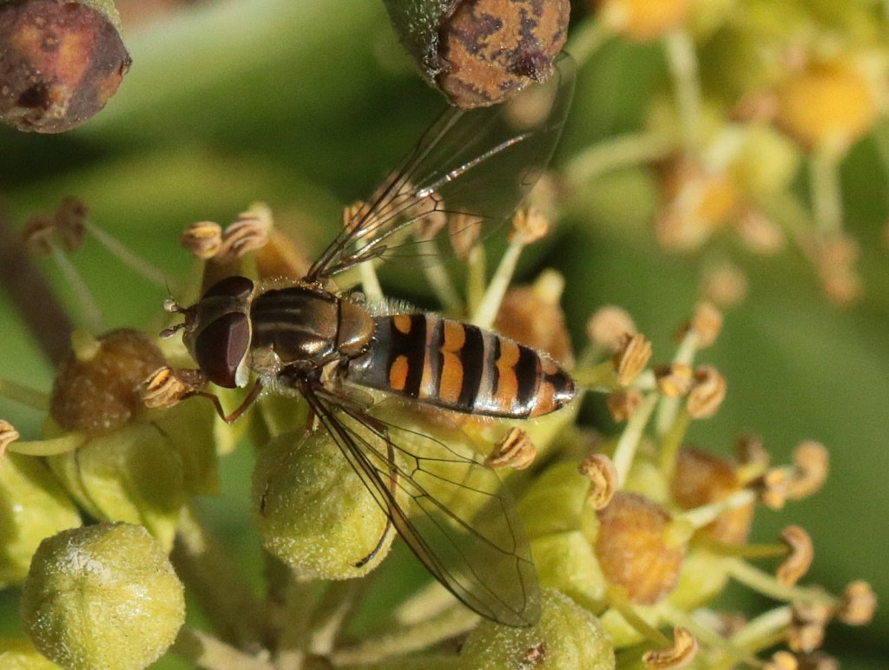

# Welcome to **Galaxy for Ecology** -- a web platform to get, process, analyze and visualize ecological data

  

  <!-- CARD 1 -->
  

    

      

        <h2 class="card-title text-dark" style="margin-top: 0;">Guide tour</h2>
        
Are you new to Galaxy, or returning after a long time, and looking for help to get started?

        
        

          <a href="https://ecology.usegalaxy.eu/tours/core.galaxy_ui" target="_blank">
            <button type="button" class="btn btn-primary btn-lg" style="white-space:normal; max-width:100%; display:inline-block;">Take a guide tour through Galaxy’s user interface.</button>
          </a>
        

      

    

  

  <!-- CARD 2 -->
  

    

      

        <h2 class="card-title text-dark" style="margin-top: 0;">Tutorials</h2>
        
Want to learn about ecology analyses?

        
        

          <a href="https://training.galaxyproject.org/training-material/topics/ecology/" class="show-iframe" data-target="displayhere">
            <button type="button" class="btn btn-primary btn-lg" style="white-space:normal; max-width:100%; display:inline-block;">Check our tutorials</button>
          </a>
        

      

    

  

  <!-- CARD 3 -->
  

    

      

        <h2 class="card-title text-dark" style="margin-top: 0;">Workflows</h2>
        
        

          <a href="https://ecology.usegalaxy.eu/workflows/list_published" target="_blank">
            <button type="button" class="btn btn-primary btn-lg" style="white-space:normal; max-width:100%; display:inline-block;">Access public workflows</button>
          </a>
        

      

    

  

  
<iframe id="displayhere" frameborder="0" style="display:none;" width="100%" height="700"></iframe>

# Projects

  <!-- CARD 1 -->
  

    

      

        <h2 class="card-title text-dark" style="margin-top: 0;">Citizen science on marmalade hoverflies</h2>
        

          Vigie Nature
          H2020 European project
        

        

          
Want to classify hoverflies pictures?

        

        
        

          <a href="https://usegalaxy.eu/gapars-experiment/" class="show-iframe" data-target="displayhere2">
            <button type="button" class="btn btn-primary btn-lg" style="white-space:normal; max-width:100%; display:inline-block;">Try our crowdsourcing project</button>
          </a>
        

      

    

  

  <!-- CARD 2 -->
  

    

        

            <h2 class="card-title text-dark" style="margin-top: 0;">Antarctic use cases</h2>
            

                French BON EBV Operationalization pilot
            

            

                
TUTORIALS

                

                    <a href="https://training.galaxyproject.org/training-material/topics/ecology/tutorials/phylodiversity_workflow/tutorial.html" target="_blank">
                        <button type="button" class="btn btn-primary">Phylodiversity analysis</button>
                    </a>
                    <a href="https://training.galaxyproject.org/training-material/topics/ecology/tutorials/Ecoregionalization_tutorial/tutorial.html" target="_blank">
                        <button type="button" class="btn btn-primary">Ecoregionalization</button>
                    </a>
                

            

            

                
WORKFLOWS

                

                    <a href="https://ecology.usegalaxy.eu/published/workflow?id=cab7b9bab4cddb0f" target="_blank">
                        <button type="button" class="btn btn-primary">State of the Environment in Antarctic</button>
                    </a>
                    <a href="https://training.galaxyproject.org/training-material/topics/ecology/tutorials/Ecoregionalization_tutorial/workflows/Ecoregionalization_workflow.html" target="_blank">
                        <button type="button" class="btn btn-primary">Ecoregionalization</button>
                    </a>
                

            

            

                
TOOLS

                
Several tools corresponding to these workflows and tutorials can be found in Galaxy's left sidebar.

            

        

    

  

  
<iframe id="displayhere2" frameborder="0" style="display:none;" width="100%" height="700"></iframe>

# Tools

Galaxy Ecology offers an extensive suite of tools designed for ecological data analysis. With hundreds of tools at your disposal, you can explore and perform a wide variety of tasks, including data manipulation, statistical analysis, ecological data retrieval, and visualization.

- **General Tools**   
These tools cover data manipulation, text processing, file conversion, sorting, filtering, and a wide range of data visualization options, including bar charts, scatterplots, heatmaps, and more.

- **Statistical Tools**  
A comprehensive set of statistical methods for data preprocessing, hypothesis testing, classification, multivariate analysis, and model-based techniques like regression and machine learning.

- **Ecological Tools**  
Galaxy Ecology provides specialized tools for ecological data, including species occurrence data retrieval, phenology analysis, acoustic monitoring, and GIS data handling.

Explore the full range of tools by using the Tools Panel on the left side of the interface. There, you’ll find an organized list of categories to help you find exactly what you need for your ecological research.

---

